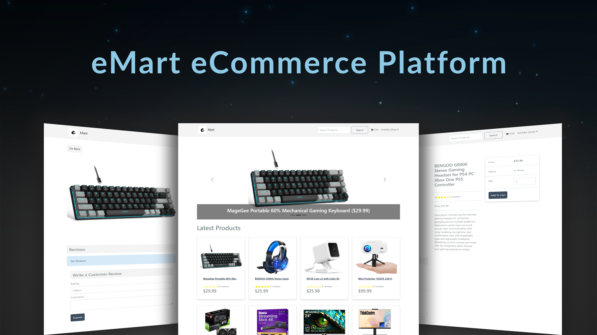

# eMart eCommerce Platform



Welcome to eMart, your ultimate destination for all your online shopping needs. Built with the powerful MERN stack (MongoDB, Express, React, Node.js) along with Redux for state management, eMart offers a comprehensive set of features for both administrators and customers, ensuring a seamless and enjoyable shopping experience.

## Introduction

eMart is designed to provide users with a hassle-free and intuitive shopping experience. Whether you're a customer looking for your favorite products or an administrator managing your online store, eMart has you covered. With features like a full-featured shopping cart, product reviews, and an easy-to-use admin dashboard, eMart makes online shopping simple and enjoyable.

## Features

- **Full featured shopping cart**: Easily add, remove, and manage products in your cart.
- **Product reviews and ratings**: Share your feedback and read reviews from other customers.
- **Top products carousel**: Discover trending and popular products at a glance.
- **Product pagination**: Navigate through large product catalogs effortlessly.
- **Product search feature**: Find exactly what you're looking for with our robust search functionality.
- **User profile with orders**: Keep track of your order history and manage your account details.
- **Admin product management**: Add, edit, and delete products with ease from the admin dashboard.
- **Admin user management**: Manage user accounts and permissions efficiently.
- **Admin Order details page**: Gain insights into order details for better management.
- **Mark orders as delivered option**: Keep customers informed about their order status.
- **Checkout process**: Smooth and secure checkout process with options for shipping and payment method selection.
- **PayPal / credit card integration**: Offer multiple payment options for a convenient shopping experience.
- **Database seeder**: Seed your database with sample users and products for testing and demonstration purposes.

## Getting Started

1. **Setup MongoDB**: Create a MongoDB database and obtain your MongoDB URI from [MongoDB Atlas](https://www.mongodb.com/cloud/atlas).

2. **Setup PayPal Integration**: Create a PayPal account and obtain your Client ID from [PayPal Developer](https://developer.paypal.com/).

3. **Environment Variables**: Rename the `.env.example` file to `.env` and add your environment variables:

```plaintext
NODE_ENV=development
PORT=5000
MONGO_URI=your_mongodb_uri
JWT_SECRET=your_jwt_secret
PAYPAL_CLIENT_ID=your_paypal_client_id
PAGINATION_LIMIT=8
```

Make sure to replace `your_mongodb_uri`, `your_jwt_secret`, and `your_paypal_client_id` with your actual credentials.

4. **Install Dependencies**: Install dependencies for both frontend and backend:

```bash
npm install
cd frontend
npm install
```

5. **Run**: Start the development server for both frontend and backend:

```bash
npm run dev
```

## Build & Deploy

To deploy your application, follow these steps:

1. **Create Frontend Production Build**:

```bash
cd frontend
npm run build
```

2. **Deploy to Hosting Platform**: Deploy your backend and frontend builds to your preferred hosting platform.

## Seed Database

To seed your database with sample data:

1. **Import Data**:

```bash
npm run data:import
```

2. **Destroy Data**:

```bash
npm run data:destroy
```

## Support

For any inquiries or assistance, feel free to reach out to our support team at support@emart.com.

Start shopping with eMart today and experience the convenience of online shopping like never before!
